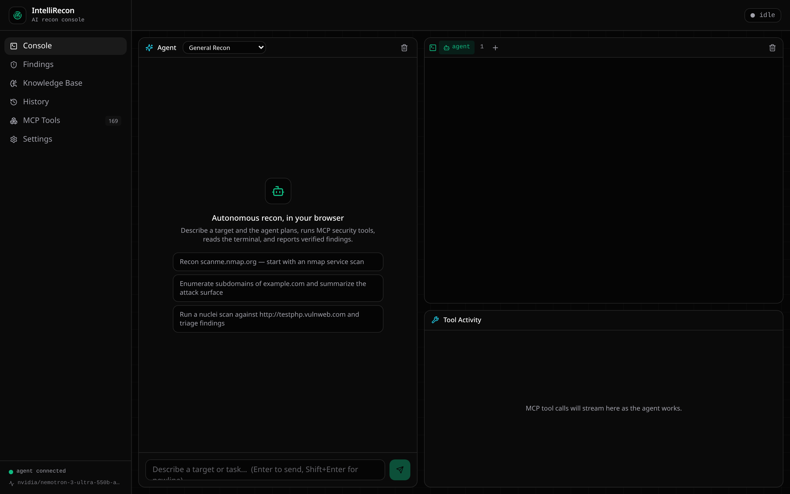

# IntelliRecon

[](https://github.com/dokotela021/intellirecon-console)
[](#)
[](#)
[](#)
[](#)
[](#)
[](#)

**A browser-native AI recon console.** An in-browser terminal and a Claude agent that drives MCP security tools, sharing one shell session — behind one thin Node backend.



Inspired by hexstrike-ai and xalgorix.

IntelliRecon is one project, three parts, all under this repo:

- **`engine/`** — the MCP-driven security-tool model, 150+ tools exposed to the agent over stdio.
- **`scanner/`** — Go CLI/TUI/webui scanner; its Geist/Vercel-dark design system (React + Vite + Tailwind v4) is what the console's UI is built on, with an emerald "recon" accent.
- **RLearning / autonomous pentest** — the agent posture: scope → enumerate → probe → verify, reporting only findings it can prove.

## What IntelliRecon adds

This isn't a side-by-side bundle of three separate tools — the merge is the point:

- **One agent, both tool surfaces.** A single Claude-driven loop plans across the engine's 150+ security tools *and* the shared shell in the same turn, instead of switching contexts between a scanner CLI and a separate tool runner.
- **Terminal handoff.** Every run writes a `HANDOFF.md` + structured `run.json` under `intellirecon-runs/`, so a `claude` (Claude Code) session started in the embedded terminal picks up exactly where the agent left off — same cwd, same findings, no re-explaining the target.
- **Durable cross-session knowledge base.** Findings, endpoints, roles, and auth notes persist per-target in SQLite (`server/db.mjs`) and are queryable by any of the 9 recon-lens modes, rather than each tool run starting cold.
- **Two swappable LLM backends.** Point `ANTHROPIC_API_KEY` at Anthropic directly, or `ANTHROPIC_BASE_URL`/`ANTHROPIC_AUTH_TOKEN` at OpenRouter (or any Anthropic-compatible gateway) — same agent loop, no code changes.
- **One consistent UI.** Console, terminal, findings, knowledge base, and tool activity all live in a single design system instead of three tools with three different look-and-feels glued together.

Everything intelligent runs in the browser + Claude. The backend is a **single file** (`server/server.mjs`) that only does the two things a browser physically can't: spawn a shell and hold an API key.

```
┌──────────────────── browser (all UI state) ────────────────────┐
│  Agent chat (Claude) │ xterm.js terminal │ MCP tool feed        │
└───────────┬───────────────────┬───────────────────┬────────────┘
        WS /agent            WS /pty              (same shell)
            │                    │
┌───────────▼────────────────────▼───────────────────────────────┐
│  server.mjs  —  Claude agent loop · PTY bridge · MCP client     │
│                         (thin, ~1 file)                          │
└───────────┬─────────────────────────────────────────────────────┘
            │ stdio
     MCP servers (engine, …)  +  local shell tools (nmap, ffuf, …)
```

## Quick start

```bash
cd intellirecon
npm install                      # builds node-pty natively (needs gcc/make)
export ANTHROPIC_API_KEY=sk-ant-...   # required for the agent

# One-time: set up the engine's Python venv — npm run dev spawns this directly,
# so it must exist first (see engine/README.md for the security-tool installs it wraps):
cd engine && python3 -m venv intellirecon-env && \
  intellirecon-env/bin/pip install -r requirements.txt && cd ..

# Development (Vite on :5173, backend on :8899, engine API on :8888, hot reload):
npm run dev
#   → open http://localhost:5173

# Or a single production process (backend serves the built UI on :8899):
npm run serve
#   → open http://localhost:8899
#   (npm run serve does NOT start the engine API — run it separately, see Configuration below)
```

If `ANTHROPIC_API_KEY` is unset, the terminal and UI still work; the agent panel shows a banner until you set it and restart.

`npm run dev` runs its three processes with `concurrently -k`, meaning **if the engine venv is missing, the whole command exits immediately** — Vite and the backend get killed too, not just the engine. Run the one-time setup above before your first `npm run dev`.

## Using it

1. Open the **Console**. The left panel is the Claude agent; the right is a live terminal over a shared MCP tool feed.
2. Type a target/task, e.g. *"Recon scanme.nmap.org — start with an nmap service scan."*
3. The agent plans, calls tools (`run_command` for local CLI tools, plus any MCP tool), reads the output, and iterates. Commands it runs are echoed into your terminal — you and the agent share one shell and one working directory.
4. For IP/CIDR-based discovery (cloud ranges, ASN blocks) rather than DNS enumeration, the agent can call [CloudRecon](https://github.com/g0ldencybersec/CloudRecon) (`go install github.com/g0ldencybersec/CloudRecon@latest`) via `run_command` — it pulls hostnames straight off TLS certs served on those IPs. Its output is merged into each run's `subdomains.txt` without needing a known apex domain first.
4. Verified issues land on the **Findings** board (exportable as JSON). Connected tools are listed under **MCP Tools**.

## Agent modes

The dropdown in the Agent panel header switches the single agent loop between 9 specialized bug-bounty recon lenses (defined in `server/agents.mjs`), plus the unrestricted default:

| Mode | Focus |
|------|-------|
| General Recon | Unrestricted — scope, enumerate, probe, verify (default). |
| JavaScript Recon | Crawl JS assets, extract endpoints/secrets/routes, build the app map. |
| API Mapping | Turn discovered endpoints into full specs; diff them for auth/validation inconsistencies. |
| Browser Analysis | Client-side behavior — DOM, storage, hidden features, network triggers. |
| Business Logic Review | Document multi-step workflows; flag steps that may not be enforced server-side. |
| Session & Token Analysis | JWTs, session cookies, refresh/CSRF tokens — lifetime, rotation, claims, cookie flags. |
| Password Reset Review | Request → email → token → reset flow: expiry, single-use, binding. |
| Authorization Analysis | Map roles, compare per-role endpoint access, surface drift/inconsistency. |
| Burp Suite Integration | Ingest a Burp site-map/proxy-history export (or a connected Burp MCP server) into the knowledge base. |
| Reporting | No new recon — assembles verified findings + the knowledge base into a submittable report. |

A mode is a system-prompt briefing plus a curated set of knowledge-base *record* tools (see below) — `run_command`, `report_finding`, and every connected MCP tool stay available in every mode, since real recon output rarely respects neat category boundaries.

## Knowledge base

Every mode reads and writes the same durable, per-target SQLite store (`server/db.mjs`) instead of redoing reconnaissance each session: JS assets, API endpoints, roles, role↔endpoint access, auth token configs, business flows, third-party origins, client-side observations, and freeform notes. Any mode can call `query_knowledge_base` to see everything recorded for a target before starting work.

Browse it on the **Knowledge Base** page (per-target, tabbed by category), or via `GET /api/kb?target=<host>` and `GET /api/kb/targets`.

## Configuration

- **Model** — defaults to `claude-opus-4-8`. Override with `INTELLIRECON_MODEL` (e.g. `claude-sonnet-5` for faster/cheaper loops).
- **Model fallback (OpenRouter only)** — `ANTHROPIC_FALLBACK_MODELS`, a comma-separated list of up to 3 model slugs. When the primary model errors (throttled, down, moderation-flagged), OpenRouter transparently retries the same request on the next model in the list before the error ever reaches chat — every entry (plus the primary) also shows up in the UI's model dropdown so the operator can pick one manually. Free OpenRouter models share one account-wide 16-req/min quota, so chaining free → free dodges a single model/provider's own outage but not a shared rate limit — put a paid model last as the real safety net, e.g. `ANTHROPIC_FALLBACK_MODELS=meta-llama/llama-3.3-70b-instruct:free,qwen/qwen3-coder:free,deepseek/deepseek-chat-v3.1` (two free models on different providers, then a paid model that isn't rationed at all). When a fallback actually serves a turn, the backend logs `fallback served this turn: <primary> -> <served>`. A paid entry only helps while its OpenRouter account has a balance — at $0 it 402s instead of rescuing anything, same as any other error (check [openrouter.ai/settings/credits](https://openrouter.ai/settings/credits)).
- **MCP servers** — edit `mcp.config.json`. Each entry is spawned over stdio; failures are non-fatal. The bundled engine's 150+ tools need its API server (`engine/intellirecon_server.py`) running on `:8888` — `npm run dev` starts it automatically alongside `web`/`api`. To run it standalone: `./engine/intellirecon-env/bin/python engine/intellirecon_server.py`.
- **MCP call timeout** — global default `INTELLIRECON_MCP_TIMEOUT_MS` (`300000`, i.e. 5 min), overriding the MCP SDK's 60 s default. Set **per-tool** ceilings under each server's `toolTimeouts` in `mcp.config.json` (values in **seconds**; `default` covers the whole server, named entries override it) — long enumerators like `amass_scan` need far more (the shipped config gives it 30 min). A ceiling is a cap, not a wait: a tool returns the instant it finishes, so generous limits are cheap, and the operator can hit **Stop** to cancel a call early. If a call still hits its ceiling, the scan may keep running on the MCP server — the agent is told to narrow scope rather than replay the same heavyweight call.
- **Port** — `PORT` (default `8899`). **Shell** — `SHELL`. **Start dir** — `INTELLIRECON_CWD`.

## Ports & endpoints

| Path | What |
|------|------|
| `GET /api/health` | model, key status, MCP tool count |
| `GET /api/agent-modes` | the 9 recon lenses + default, for the mode dropdown |
| `GET /api/kb?target=<host>` | full knowledge base for one target |
| `GET /api/kb/targets` | every target with knowledge-base entries |
| `WS /pty` | terminal ↔ node-pty (JSON control frames up, raw output down) |
| `WS /agent` | Claude agent (streamed deltas, tool calls, findings, `set_mode`) |

## Safety

IntelliRecon is for **authorized** security testing, bug bounty, and CTF work. The agent runs real commands on your machine against the targets you give it — only point it at systems you have permission to test.

## Stack

React 18 · Vite 5 · Tailwind v4 · xterm.js · Node (ws + node-pty) · `@anthropic-ai/sdk` · `@modelcontextprotocol/sdk`.
